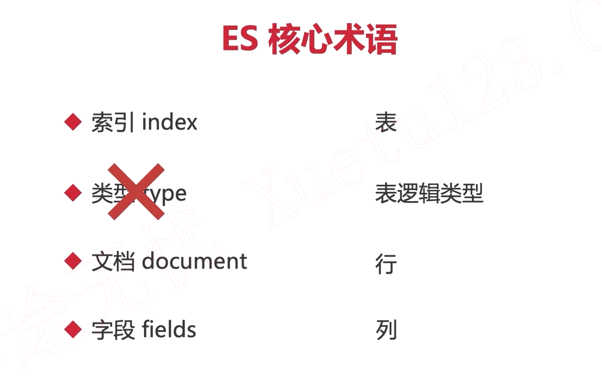

# 核心术语




# 集群原理


# 倒排索引


# 常用API


## 创建索引

```http
PUT http://192.168.248.128:9200/index_demo
Content-Type: application/json

{
    "settings": {
        "index": {
            "number_of_shards": "5",
            "number_of_replicas": "0"
        }
    }
}
```

## 删除索引

```http
DELETE http://192.168.248.128:9200/index_demo
```

## 创建包含映射的索引

```http
PUT http://192.168.248.128:9200/index_mapping
Content-Type: application/json

{
  "mappings": {
    "properties": {
      "realname": {
        "type": "text",
        "index": true
      },
      "username": {
        "type": "keyword",
        "index": false
      }
    }
  }
}
```

## 分词

```http
GET http://192.168.248.128:9200/index_mapping/_analyze
Content-Type: application/json

{
  "field": "realname",
  "text": "fyb is good"
}
```

执行第一次

```json
{
  "tokens": [
    {
      "token": "fyb",
      "start_offset": 0,
      "end_offset": 3,
      "type": "<ALPHANUM>",
      "position": 0
    },
    {
      "token": "is",
      "start_offset": 4,
      "end_offset": 6,
      "type": "<ALPHANUM>",
      "position": 1
    },
    {
      "token": "good",
      "start_offset": 7,
      "end_offset": 11,
      "type": "<ALPHANUM>",
      "position": 2
    }
  ]
}
```

执行第二次返回JSON与第一次相同。

## 修改映射（新增数据类型）

```http
POST http://192.168.248.128:9200/index_mapping/_mapping
Content-Type: application/json

{
  "properties": {
    "id": {
      "type": "long"
    },
    "age": {
      "type": "integer"
    }
  }
}
```

## 添加文档与自动映射

```http
POST http://192.168.248.128:9200/my_doc/_doc/2
Content-Type: application/json

{
  "id": 1002,
  "name": "imooc-2",
  "desc": "imooc is very fashion,慕课网非常时尚"
}
```

添加文档的操作，顺便自动为索引创建了映射。

## 文档的删除与修改

删除

```http
DELETE http://192.168.248.128:9200/my_doc/_doc/2
```

局部修改

```http
POST http://192.168.248.128:9200/my_doc/_doc/2/_update
Content-Type: application/json

{
  "doc": {
    "name": "xxx"
  }
}
```

全量修改

```http
PUT http://192.168.248.128:9200/my_doc/_doc/2
Content-Type: application/json

{
  "id": 1002,
  "name": "xxx",
  "desc": "慕课网很强大",
  "create": "2022-02-08"
}
```

## 文档查询

根据ID查询

```http
GET http://192.168.248.128:9200/my_doc/_doc/2
```

查询所有

```http
GET http://192.168.248.128:9200/my_doc/_doc/_search
```

定制化查询

```http
GET http://192.168.248.128:9200/my_doc/_doc/2?_source=id,name
```

```json
{
  "_index": "my_doc",
  "_type": "_doc",
  "_id": "2",
  "_version": 9,
  "_seq_no": 14,
  "_primary_term": 1,
  "found": true,
  "_source": {
    "name": "xxx",
    "id": 1002
  }
}
```

查询文档是否存在

```http
HEAD http://192.168.248.128:9200/my_doc/_doc/2?_source=id,name

Response code: 200 (OK);
```

## 文档乐观锁控制

```http
POST http://192.168.248.128:9200/my_doc/_doc/2?if_seq_no=15&if_primary_term=1
Content-Type: application/json

{
  "name": "xxx_XXXX"
}
```

# 分词与内置分词器

## 内置分词器

```http
POST  http://192.168.248.128:9200/_analyze
Content-Type: application/json

{
  "analyzer": "standard",
  "text": "我在github学习"
}
```

```json
{
  "tokens": [
    {
      "token": "我",
      "start_offset": 0,
      "end_offset": 1,
      "type": "<IDEOGRAPHIC>",
      "position": 0
    },
    {
      "token": "在",
      "start_offset": 1,
      "end_offset": 2,
      "type": "<IDEOGRAPHIC>",
      "position": 1
    },
    {
      "token": "github",
      "start_offset": 2,
      "end_offset": 8,
      "type": "<ALPHANUM>",
      "position": 2
    },
    {
      "token": "学",
      "start_offset": 8,
      "end_offset": 9,
      "type": "<IDEOGRAPHIC>",
      "position": 3
    },
    {
      "token": "习",
      "start_offset": 9,
      "end_offset": 10,
      "type": "<IDEOGRAPHIC>",
      "position": 4
    }
  ]
}
```

中文分词不友好。

## 中文分词器

```shell
sudo unzip elasticsearch-analysis-ik-7.17.0.zip -d /usr/share/elasticsearch/plugins/ik
```

然后重启就安装完成。

### ik_max_word

```http
###分词
POST  http://192.168.248.128:9200/_analyze
Content-Type: application/json

{
  "analyzer": "ik_max_word",
  "text": "我在github学习"
}
```

```json
{
  "tokens": [
    {
      "token": "我",
      "start_offset": 0,
      "end_offset": 1,
      "type": "CN_CHAR",
      "position": 0
    },
    {
      "token": "在",
      "start_offset": 1,
      "end_offset": 2,
      "type": "CN_CHAR",
      "position": 1
    },
    {
      "token": "github",
      "start_offset": 2,
      "end_offset": 8,
      "type": "ENGLISH",
      "position": 2
    },
    {
      "token": "学习",
      "start_offset": 8,
      "end_offset": 10,
      "type": "CN_WORD",
      "position": 3
    }
  ]
}{
  "tokens": [
    {
      "token": "我",
      "start_offset": 0,
      "end_offset": 1,
      "type": "CN_CHAR",
      "position": 0
    },
    {
      "token": "在",
      "start_offset": 1,
      "end_offset": 2,
      "type": "CN_CHAR",
      "position": 1
    },
    {
      "token": "github",
      "start_offset": 2,
      "end_offset": 8,
      "type": "ENGLISH",
      "position": 2
    },
    {
      "token": "学习",
      "start_offset": 8,
      "end_offset": 10,
      "type": "CN_WORD",
      "position": 3
    }
  ]
}
```

### ik_smart

ik_max_word: 会将文本做最细粒度的拆分，比如会将“中华人民共和国国歌”拆分为“中华人民共和国,中华人民,中华,华人,人民共和国,人民,人,民,共和国,共和,和,国国,国歌”，会穷尽各种可能的组合，适合 Term Query；

ik_smart: 会做最粗粒度的拆分，比如会将“中华人民共和国国歌”拆分为“中华人民共和国,国歌”，适合 Phrase 查询。

### 自定义中文词库

# DSL搜索

## 创建映射指定分词器

```http
POST http://192.168.248.128:9200/shop/_mapping
Content-Type: application/json

{
  "properties": {
    "id": {
      "type": "long"
    },
    "desc": {
      "type": "text",
      "analyzer": "ik_max_word"
    }
  }
}
```